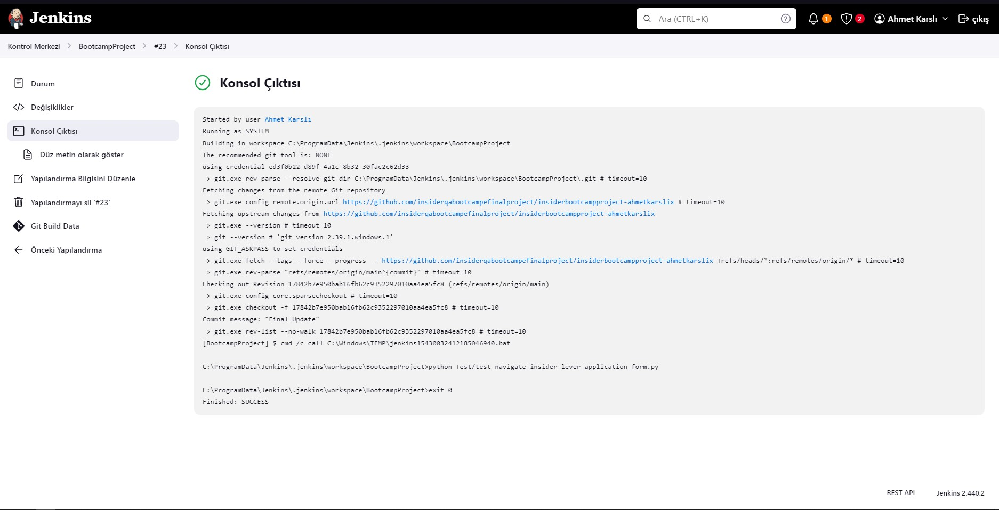
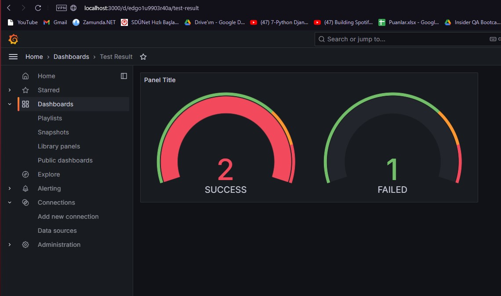

# Insider Bootcamp Task
Bu proje, tarayıcı tabanlı testler için Selenium'u, Sürekli Entegrasyon/Sürekli Dağıtım (CI/CD) için Jenkins'i ve test sonuçlarını görselleştirmek için Grafana'yı kullanarak uçtan uca bir test hattını göstermektedir.


## Gereksinimler

- Python 3.9.x /3.12.x
- Selenium WebDriver
- Jenkins 2.4xx
- Grafana 10.x.x
- MySQL Workbench & Server
- Docker (isteğe bağlı)
## Automated UI Testing
Otomatik Kullanıcı Arayüzü Testleri

Daha okunabilir ve düzenlenebilir kod için "Page Object Model" (POM) kullanılmıştır.

Doğru senkronizasyon ve verimli test yürütme için "time.sleep()" fonksiyonları yerine "Wait Expected Condition" kullanılmıştır.

Her eylemden sonra test sonuçlarını anlamayı kolaylaştırmak için loglama eklenmiştir.

Projeyi klonlamak için:
```bash
  git clone https://github.com/insiderqabootcampefinalproject/insiderbootcampproject-ahmetkarslix.git
```
Testleri çalıştırmak için:

Windows:
```bash
  python.exe test_navigate_insider_lever_application_form.py
```
Mac:
```bash
  python3 test_navigate_insider_lever_application_form.py
```

## CI/CD Pipeline Integration
CI/CD Pipeline Entegrasyonu

Jenkins'i makinenize veya sunucunuza kurun.
Projeyi depoya bağlayarak yeni bir pipeline projesi oluşturun.

Token Oluşturma:
GitHub üzerinde yeni bir yetkilendirme token oluşturun ve Jenkins'e bu token'i "Password" bölümüne girerek kullanıcı girişi sağlayın.

Bu görev sırasında Windows kullandığımız için Jenkins'te venv ve path hatalarıyla karşılaştık.

Ekran Görüntüsü :


Bu nedenle, Test Sonuçlarının Görselleştirilmesi bölümüne devam etmek için Jenkins ile çalışmayıp yerelde devam ettik.


## Test Results Visualization
Test Sonuçlarının Görselleştirilmesi

Veritabanı Oluşturma:
MySQL üzerinde belirli bir "host adresi" ve "şifre" ile bir veritabanı oluşturun.

Sonrasında, "result" ve "id" değerlerini tutmak için bir tablo yapısı oluşturun.

Veritabanı bağlantısını sağlamak için test kodunda gerekli ayarlamalar yapıldı (bağlantı kurma, sorgu yürütme, test sonucu kaydetme gibi).

Grafana'yı veritabanına bağlayın ve Grafana üzerinde bir gösterge tablosu ekleyin.

Grafana Örneği: 

